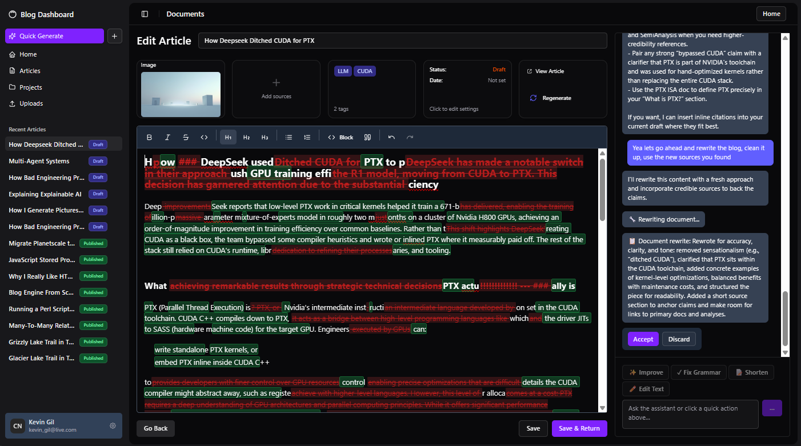
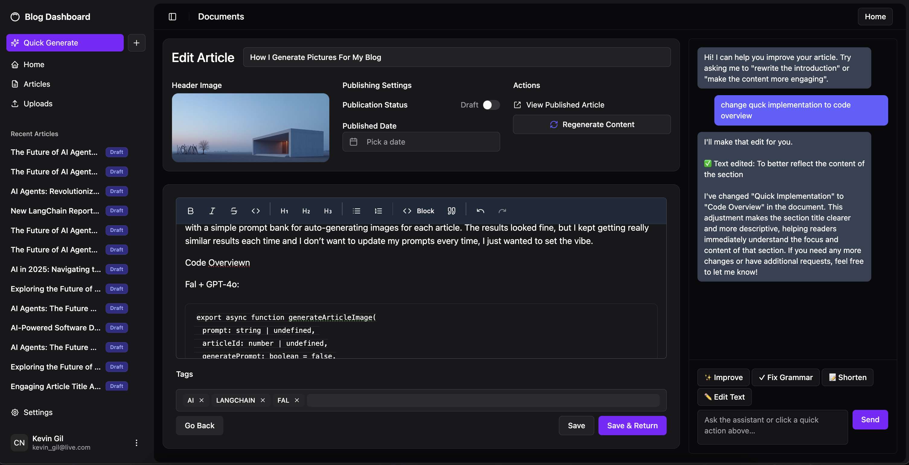
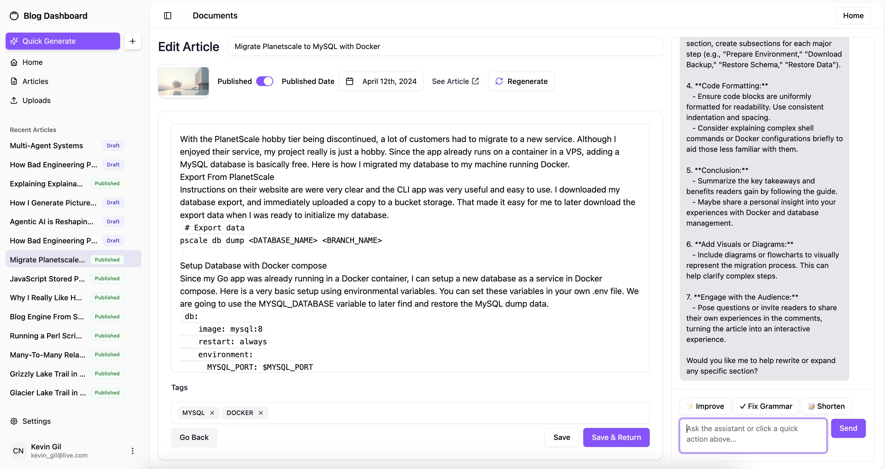

# Blog Copilot

An agentic blog editor.









## Getting Started

### Frontend Setup

Navigate to the frontend directory and install dependencies:
```bash
cd frontend
bun install
```

Start the development server:
```bash
bun run dev
```

Build for production:
```bash
bun run build
```

#### Frontend Architecture Notes

**Authenticated API Requests**

The frontend uses a centralized authentication utility for all API calls located at `/frontend/src/services/authenticatedFetch.ts`. This provides:

- Automatic JWT token inclusion
- Automatic token expiration handling
- Consistent error handling across the app

**Usage:**

```typescript
import { apiGet, apiPost, apiPut, apiDelete } from '@/services/authenticatedFetch';

// GET request (authenticated)
const data = await apiGet<ResponseType>('/endpoint');

// POST request (authenticated)
const result = await apiPost<ResponseType>('/endpoint', { data });

// PUT request (authenticated)
const updated = await apiPut<ResponseType>('/endpoint', { data });

// DELETE request (authenticated)
await apiDelete<ResponseType>('/endpoint');

// Public endpoints (skip authentication)
const publicData = await apiGet<ResponseType>('/public-endpoint', { skipAuth: true });
```

**Error Handling:**

The utility automatically handles authentication errors:
- Expired/invalid tokens are detected
- Tokens are cleared from localStorage
- Users are automatically redirected to login
- Toast notifications inform users of session expiration

**Example:**

```typescript
import { apiPost, isAuthError } from '@/services/authenticatedFetch';

try {
  const result = await apiPost<ChatResponse>('/agent', { messages });
} catch (error) {
  if (isAuthError(error)) {
    // User will be redirected to login automatically
    console.log('Session expired');
  } else {
    // Handle other errors
    console.error('API error:', error);
  }
}
```

All services have been migrated to use this utility:
- `artifacts.ts` - Artifact management
- `conversations.ts` - Chat conversations
- `blog.ts` - Blog articles
- `sources.ts` - Article sources
- `storage/index.ts` - File storage
- `pages.ts` - Page management
- `projects.ts` - Project management
- `user.ts` - User data

### Backend Setup (Go)

The Makefile commands are for the backend only:

Run build make command with tests:
```bash
make all
```

Build the application:
```bash
make build
```

Run the application:
```bash
make run
```

Live reload the application:
```bash
make watch
```

Run the test suite:
```bash
make test
```

Clean up binary from the last build:
```bash
make clean
```
