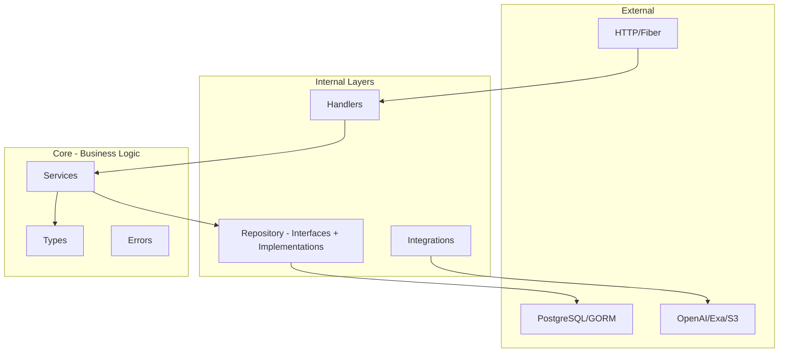
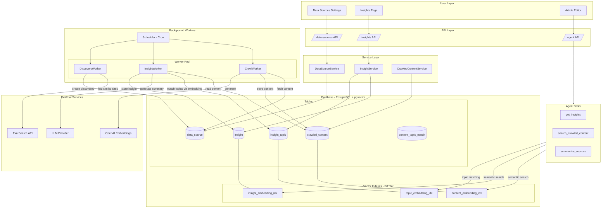

# Blog Copilot

An agentic blog editor.


## Getting Started

### Frontend Setup

Navigate to the frontend directory and install dependencies:
```bash
cd frontend
bun install
```

Start the development server:
```bash
bun run dev
```

Build for production:
```bash
bun run build
```

### Backend Setup (Go)

The Makefile commands are for the backend only:

Run build make command with tests:
```bash
make all
```

Build the application:
```bash
make build
```

Run the application:
```bash
make run
```

Live reload the application:
```bash
make watch
```

Run the test suite:
```bash
make test
```

Clean up binary from the last build:
```bash
make clean
```

### API Client Generation

The frontend TypeScript client is auto-generated from the backend's OpenAPI spec using [@hey-api/openapi-ts](https://heyapi.dev/).

Regenerate the client after API changes:
```bash
make generate-client
```

This runs `swag init` to generate Swagger docs from Go annotations, then generates typed TypeScript SDK classes in `frontend/src/client/`.

**Usage:**
```typescript
import { Articles, Auth } from './client'

const { data } = await Auth.postAuthLogin({ body: { email, password } })
const articles = await Articles.getBlogArticles({ query: { page: 1 } })
```

### Quick Overview


#### Backend clean code architecture layers


Dependencies point inward toward core.




#### Data Pipeline and Insights System



