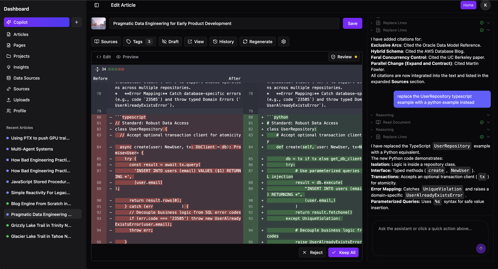

# Blog Copilot

An agentic blog editor with a React/Bun frontend and an Axum/Rust backend.
The legacy Go backend is no longer vendored. Its pinned source reference and
the retained porting evidence live in `docs/porting/`.



## Run the full stack

Docker Compose provides PostgreSQL 17.4 with pgvector, Diesel migrations,
deterministic OpenAI/Exa fixtures, MinIO, the Rust API, and the frontend:

```bash
docker compose up --build
```

- Frontend: <http://localhost:3000>
- API: <http://localhost:8080>
- Health: <http://localhost:8080/health>
- Swagger UI: <http://localhost:8080/swagger>
- OpenAPI: <http://localhost:8080/api/openapi.json>
- MinIO console: <http://localhost:9001>

The local database and object store use named volumes. Tests never connect to
the production Supabase database.

## Development

Docker Compose is the hermetic default and needs no environment file. For a
native backend, copy the tracked local profile and start only its dependencies:

```bash
cp env/local.env.example env/local.env
docker compose up -d db external-fixtures object-storage object-storage-init
./scripts/with-env.sh env/local.env \
  cargo run --manifest-path backend/Cargo.toml --locked --bin blog-backend
```

The profiles under `env/` are explicit local command inputs:

- `local.env` connects native processes to local Docker dependencies.
- `testing.env` supplies only local fixture and test-database settings.
- `production.env` is for deliberate local access to Supabase and production
  services. It must never contain `TEST_DATABASE_URL`.

Copy the corresponding `*.env.example` file to create a profile. Real `*.env`
files are ignored by Git and excluded from Docker build contexts. Render remains
the production source of environment variables and does not use these files.
See [`env/README.md`](env/README.md) for the command convention.

```bash
cd frontend
bun install --frozen-lockfile
bun run dev
```

## Verification

The blocking Rust matrix is partitioned into exact targets so failures identify
their owning domain:

```bash
cp env/testing.env.example env/testing.env
docker compose --profile test up -d \
  test-db test-migrate external-fixtures object-storage object-storage-init
./scripts/with-env.sh env/testing.env \
  cargo test --manifest-path backend/Cargo.toml --locked --test article_service
```

Select only the targeted test required for the change. The broader maintained
test scripts remain available for explicit release verification. The test
profile uses a separate `blog_test` PostgreSQL database on port `55433`; it does
not reuse the normal local `blog` database.

Run the same blocking matrix in the pinned Docker environment:

```bash
docker compose --profile test run --build --rm test
```

The insight behavior target is always compiled and executed, but CI reports its
11 exact cases separately because that subsystem remains work in progress.

The Go/Rust parity environment uses independent PostgreSQL 17.4 databases. It
fetches the pinned [kevingil/blog-go](https://github.com/kevingil/blog-go)
source as a Docker build context, so the reference implementation does not
remain in this repository:

```bash
docker compose -f docker-compose.parity.yml up --build \
  --abort-on-container-exit --exit-code-from contract-tests contract-tests
```

Porting evidence, contract classifications, migration adoption instructions,
and task ownership live in `docs/porting/`.

## OpenAPI and frontend client

Axum routes and the OpenAPI document share the same Utoipa construction path.
The frontend client is generated from that document:

```bash
./scripts/generate-client.sh
node ./scripts/verify-openapi-contracts.mjs
```

Generated files under `frontend/src/client/` must not be edited by hand.
Frontend service adapters use the generated SDK and add only application-level
authentication, envelope, and view-model behavior.

## Architecture

Dependencies point inward and production dependencies are assembled once in
`backend/src/bootstrap.rs`:

```text
api (Axum DTOs, handlers, OpenAPI)
  -> core (domain services and consumer-owned ports)
       <- database (Diesel/PostgreSQL)
       <- integrations (OpenAI, Exa, S3, fetch/extract)

bootstrap -> AppState -> typed FromRef substates
```

Application-owned cancellation tokens and task sets cover the HTTP server,
article/image queues, copilot requests and WebSocket bridges, workers, and
graceful SIGINT/SIGTERM shutdown.
