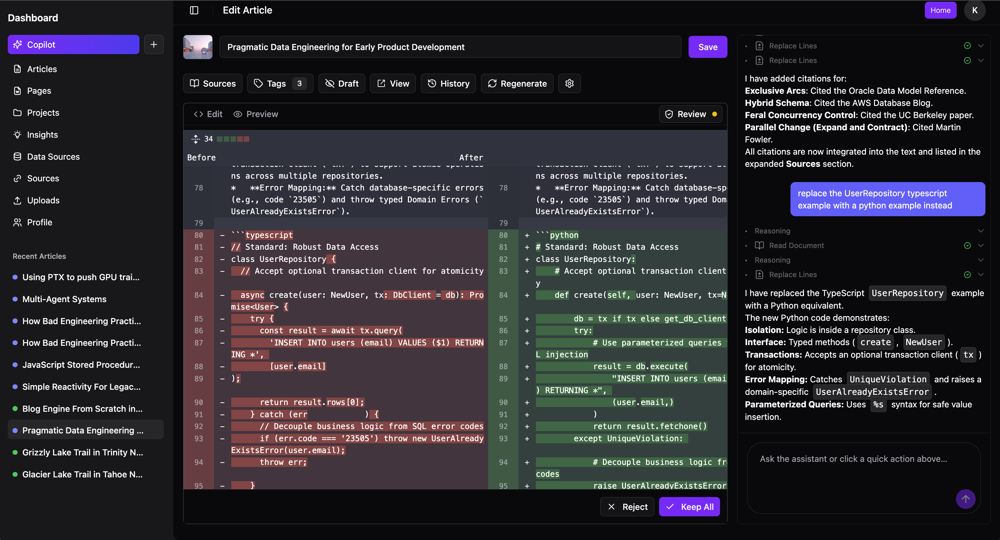

# Blog Copilot

An agentic blog editor with a React/Bun frontend and an Axum/Rust backend.



## Run the full stack

Docker Compose provides PostgreSQL 17.4 with pgvector, Diesel migrations,
deterministic OpenAI/Exa fixtures, MinIO, the Rust API, and the frontend:

```bash
docker compose up --build
```

- Frontend: <http://localhost:3000>
- API: <http://localhost:8080>
- Health: <http://localhost:8080/health>
- Swagger UI: <http://localhost:8080/swagger>
- OpenAPI: <http://localhost:8080/api/openapi.json>
- MinIO console: <http://localhost:9001>

The local database and object store use named volumes. Tests never connect to
the production Supabase database.

## Development

Docker Compose is the hermetic default and needs no environment file. For a
native backend, copy the tracked local profile and start only its dependencies:

```bash
cp env/local.env.example env/local.env
docker compose up -d db external-fixtures object-storage object-storage-init
./scripts/with-env.sh env/local.env \
  cargo run --manifest-path backend/Cargo.toml --locked --bin blog-backend
```

The profiles under `env/` are explicit local command inputs:

- `local.env` connects native processes to local Docker dependencies.
- `testing.env` supplies only local fixture and test-database settings.
- `production.env` is for deliberate local access to Supabase and production
  services. It must never contain `TEST_DATABASE_URL`.

Copy the corresponding `*.env.example` file to create a profile. Real `*.env`
files are ignored by Git and excluded from Docker build contexts. Render remains
the production source of environment variables and does not use these files.
See [`env/README.md`](env/README.md) for the command convention.

```bash
cd frontend
bun install --frozen-lockfile
bun run dev
```

For native frontend development, put browser-visible values in `frontend/.env`:

```env
VITE_API_BASE_URL=http://localhost:8080
VITE_WS_URL=ws://localhost:8080/websocket
VITE_PUBLIC_S3_URL_PREFIX=http://localhost:9000/blog
```

`VITE_GA_MEASUREMENT_ID` is optional. Leave it unset locally. Set it to a GA4
measurement ID (`G-…`) only in the production frontend build.

The backend's `PUBLIC_API_URL` and `PUBLIC_APP_URL` configure MCP OAuth callback
and return origins. Model endpoints in the local profile use fixtures; unset
model endpoints use the real OpenAI, Groq, and Exa APIs.

## Migrations and Render deployment

The production database already has the seven Goose migrations through
`20260315000000`. Preserve those SQL bodies and version IDs. Stamp their Diesel
ledger entries once, then apply the four newer Diesel migrations for connectors,
skills, external article URLs, and upload records. Do not revert or replay the
historical schema against this database.

[`scripts/pre-deploy.sh`](scripts/pre-deploy.sh) performs this sequence on every
Render API deploy. It exits before migration if the initial schema fingerprint
does not match or an existing Diesel ledger is missing baseline versions. Once
adopted, subsequent deploys apply only pending migrations. See the
[adoption runbook](docs/porting/MIGRATION_ADOPTION.md) for the exact commands,
retry behavior, and fingerprint limitations. Fresh local databases still use
`migrate` directly through Compose.

[`render.yaml`](render.yaml) defines one native Rust API service, pinned to Rust
1.92.0. The frontend stays on Cloudflare and is not provisioned by this Blueprint.
Sync it in the **personal Render workspace** after merging this PR. It reuses
the existing Supabase database and S3-compatible storage; it creates neither.
Confirm the API region before creating the service. Supply the prompted secrets
and public URLs in that workspace:

| Setting | Value |
| --- | --- |
| `DATABASE_URL` | Existing Supabase direct or session-pooled URL with TLS; not a transaction pooler (migrations hold a session advisory lock) |
| `AUTH_SECRET` | Existing signing secret |
| `PUBLIC_API_URL`, `VITE_API_BASE_URL` | Public HTTPS API origin, without a trailing slash |
| `PUBLIC_APP_URL`, `ALLOWED_ORIGINS` | Public HTTPS frontend origin (`ALLOWED_ORIGINS` also accepts comma-separated origins) |
| `VITE_WS_URL` | Public API origin using `wss://`, followed by `/websocket` |
| `S3_URL_PREFIX`, `VITE_PUBLIC_S3_URL_PREFIX` | Existing public bucket/CDN prefix |
| Other `S3_*`, provider API keys | Existing production credentials and bucket settings |

The native build compiles only the API, migrator, stamper, and fingerprint
diagnostic into `backend/target/release`. Pre-deploy runs
`./scripts/pre-deploy.sh backend/target/release`; start runs
`./backend/target/release/blog-backend`. Docker remains available for local
Compose and migration diagnostics, but Render no longer builds or pushes its
image/cache layers. A cold native build still compiles the Rust dependencies.
Builds require PostgreSQL's `libpq` development library; runtime requires libpq
and trusted CA certificates. HEIC uploads are converted to JPEG before storage.
iPhone photos from iOS 18 need libheif 1.18 or newer; Debian 12's default
1.15.1 rejects them. Docker images install that newer `heif-convert` from
bookworm-backports. Render's native image has no HEIF decoder, so
`scripts/vendor-heif.sh` copies one into `backend/opt/heif` during the build
and the API runs that copy.

For an existing Blueprint-managed Docker service, merge this change and sync
the Blueprint to switch its runtime to Rust and apply the build, pre-deploy,
and start commands together. Render supports this [runtime change in place](https://render.com/docs/native-runtimes#changing-a-services-runtime).

The API's async PostgreSQL pool supports TLS with certificate and hostname
verification. Use `sslmode=require` in the production
`DATABASE_URL` to prevent unencrypted connections. For Render, Supabase's shared
session pooler on port `5432` provides IPv4 connectivity without its paid direct
IPv4 add-on and supports the migration session lock. Copy the exact URL from
Supabase's Connect dialog. Do not use the transaction pooler on port `6543`.
Local PostgreSQL without TLS remains supported through its default `prefer`
mode. The synchronous migration binaries use libpq, so verify API database
connectivity as well as successful migrations during deployment.

### Supabase TLS certificate on Render

Configure the Supabase root CA before deploying the API. The API loads system
roots by default, which may not trust Supabase's database certificate chain.
The existing Rust code supports the certificate environment variables below;
no code change is needed.

1. In the Supabase **blog** project, open **Database → Settings → SSL
   configuration → Download certificate**. Use the certificate supplied by
   that project. See [Supabase's SSL documentation](https://supabase.com/docs/guides/platform/ssl-enforcement).
2. In the **personal Render workspace**, open **blog-backend → Environment →
   Secret Files → Add file**. Name it `supabase-ca.crt` and paste the entire
   downloaded PEM, including `BEGIN CERTIFICATE` and `END CERTIFICATE` lines.
   Choose **Save only** while preparing the remaining settings.
3. Add these service environment variables:

   | Variable | Value |
   | --- | --- |
   | `SSL_CERT_FILE` | `/etc/secrets/supabase-ca.crt` |
   | `SSL_CERT_DIR` | `/etc/ssl/certs` |

   Both settings matter: setting either overrides the TLS library's default
   certificate discovery. The directory retains Render's system CA roots
   alongside the Supabase CA. These are Dashboard-managed settings; the
   Blueprint does not provision the certificate file or these variables.
4. Choose **Save and deploy**. Render may still run a cached build. Verify
   **Deploy succeeded | Live** and the API's `server listening` log. Certificate
   and hostname verification remain enabled.

If pre-deploy succeeds but the API exits with `error performing TLS handshake`,
check this certificate configuration. The migration binaries use libpq, where
`sslmode=require` normally encrypts without verifying the server certificate;
the API's Rust TLS client verifies it. Successful migrations therefore do not
prove the API trusts the server. After fixing trust, redeploy normally: the
stamper skips recorded baseline versions and the migrator applies only pending
versions. Do not reset the ledger or rerun historical SQL to fix a TLS error.

### Frontend configuration and cutover

Set backend variables in Render and frontend `VITE_*` variables at the frontend
host. Use public hostnames or custom domains, not internal service hosts.
Frontend `VITE_*` values are public and baked into the build; rebuild it after
changing them and configure its host to rewrite SPA deep links to `index.html`.
Set `VITE_GA_MEASUREMENT_ID` in the Cloudflare build environment when the
deployed site should load Google Analytics. The tag is omitted unless that
value is a GA4 measurement ID, so local builds, Compose, and forks stay quiet.

The Cloudflare Workers frontend uses
[`frontend/wrangler.jsonc`](frontend/wrangler.jsonc) to serve Vite's `dist`
directory with `assets.not_found_handling: "single-page-application"`. This
serves `index.html` for direct navigation to React routes such as
`/projects?page=1`. In Cloudflare Builds, use `frontend` as the root directory,
`bun run build` as the build command, and `npx wrangler deploy` as the deploy
command. Redeploy the frontend after changing this configuration.

The API uses Render's [pre-deploy command](https://render.com/docs/deploys#pre-deploy-command)
on a paid service, so migration failure blocks the new API deployment.
Production never runs the local fixture seed. Existing accounts remain intact.

The existing Fly deploy workflow remains enabled until the compute cutover;
merging to `main` can still deploy there. Coordinate its disablement and the
frontend domain cutover with the first successful Render deployment.

## Verification

The blocking Rust matrix is partitioned into exact targets so failures identify
their owning domain:

```bash
cp env/testing.env.example env/testing.env
docker compose --profile test up -d \
  test-db test-migrate external-fixtures object-storage object-storage-init
./scripts/with-env.sh env/testing.env \
  cargo test --manifest-path backend/Cargo.toml --locked --test article_service
```

Select only the targeted test required for the change. The broader maintained
test scripts remain available for explicit release verification. The test
profile uses a separate `blog_test` PostgreSQL database on port `55433`; it does
not reuse the normal local `blog` database.

Run the same blocking matrix in the pinned Docker environment:

```bash
docker compose --profile test run --build --rm test
```

The insight behavior target is always compiled and executed, but CI reports its
11 exact cases separately because that subsystem remains work in progress.

The Go/Rust parity environment uses independent PostgreSQL 17.4 databases. It
fetches the pinned [kevingil/blog-go](https://github.com/kevingil/blog-go)
source as a Docker build context, so the reference implementation does not
remain in this repository:

```bash
docker compose -f docker-compose.parity.yml up --build \
  --abort-on-container-exit --exit-code-from contract-tests contract-tests
```

## OpenAPI and frontend client

Axum routes and the OpenAPI document share the same Utoipa construction path.
The frontend client is generated from that document:

```bash
./scripts/generate-client.sh
node ./scripts/verify-openapi-contracts.mjs
```

Generated files under `frontend/src/client/` must not be edited by hand.
Frontend service adapters use the generated SDK and add only application-level
authentication, envelope, and view-model behavior.

## Architecture

Dependencies point inward and production dependencies are assembled once in
`backend/src/bootstrap.rs`:

```text
api (Axum DTOs, handlers, OpenAPI)
  -> core (domain services and consumer-owned ports)
       <- database (Diesel/PostgreSQL)
       <- integrations (OpenAI, Exa, S3, fetch/extract)

bootstrap -> AppState -> typed FromRef substates
```

Application-owned cancellation tokens and task sets cover the HTTP server,
article/image queues, copilot requests and WebSocket bridges, workers, and
graceful SIGINT/SIGTERM shutdown.
